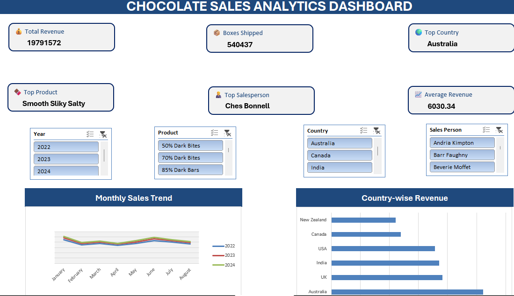
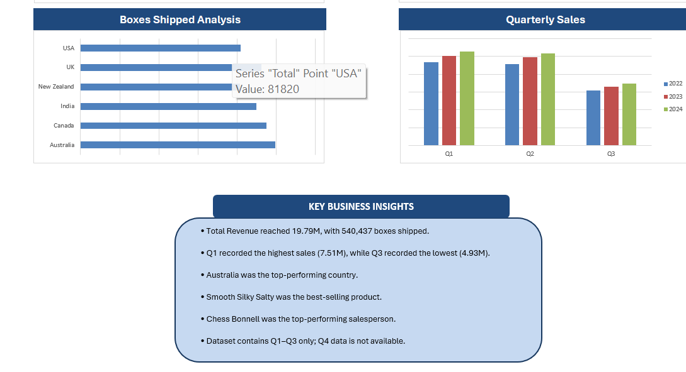

# chocolate-sales-dashboard-excel
Interactive Chocolate Sales Dashboard built using Microsoft Excel with Data Cleaning, Pivot Tables, Pivot Charts, KPI Cards, Slicers and Business Insights.
This project demonstrates practical Excel skills used by Data Analysts to transform raw sales data into meaningful business insights and interactive reports.
## 📊 Dashboard Preview

### Dashboard - Top Section

### Dashboard - Bottom Section

# 📖 Project Overview

The Chocolate Sales Dashboard is an interactive Microsoft Excel project developed to analyze and visualize chocolate sales data. The project transforms raw sales records into meaningful business insights using Excel's analytical features.

The dashboard enables users to monitor sales performance, compare countries and products, evaluate salesperson performance, and identify sales trends through interactive filters and dynamic visualizations.
# 🎯 Project Objectives

- Clean and transform raw sales data into an analysis-ready dataset.
- Build interactive Pivot Tables and Pivot Charts.
- Create KPI cards to monitor key business metrics.
- Design a professional dashboard using Microsoft Excel.
- Enable dynamic filtering using slicers.
- Generate business insights to support decision-making.
# ✨ Dashboard Features

- 📊 Interactive Dashboard with dynamic slicers
- 📈 KPI Cards displaying Total Revenue, Average Revenue, Total Orders, Total Boxes Shipped, Total Salespersons, and Total Products
- 🌍 Country-wise Sales Analysis
- 📅 Monthly Sales Trend Analysis
- 👤 Top Salesperson Performance Analysis
- 🍫 Top Product Performance Analysis
- 📦 Boxes Shipped Analysis
- 📉 Pivot Tables and Pivot Charts for interactive reporting
# 📊 Key Performance Indicators (KPIs)

- 💰 Total Revenue
- 📦 Total Boxes Shipped
- 📋 Total Orders
- 👤 Total Salespersons
- 🍫 Total Products
- 📈 Average Revenue per Order
# 💡 Business Insights

- 🇦🇺 Australia generated the highest overall sales.
- 🍫 Smooth Silky Salty emerged as the top-selling product.
- 👤 Chess Bonnell achieved the highest sales among all salespersons.
- 📈 Sales performance varied across months and countries, highlighting seasonal demand trends.
- 📦 Product shipment volumes differed significantly across products, helping identify high-demand items.
# 🛠️ Tools & Skills Used

### Tools
- Microsoft Excel 2019
- GitHub

### Excel Features
- Data Cleaning
- Pivot Tables
- Pivot Charts
- Slicers
- KPI Cards
- Conditional Formatting
- Charts & Visualizations
- Excel Formulas (SUM, AVERAGE, COUNT, IF, etc.)

### Skills Demonstrated
- Data Cleaning
- Data Analysis
- Dashboard Design
- Business Intelligence
- Data Visualization
- Analytical Thinking
- Reporting
# 📂 Project Structure
Chocolate-Sales-Dashboard/
│
├── Dashboard/
│   └── Chocolate_Sales_Dashboard.xlsx
│
├── Data/
│   └── README.md
│
├── Documentation/
│   └── README.md
│
├── Images/
│   ├── Dashboard_top.png
│   └── Dashboard_bottom.png
│
├── README.md
└── LICENSE
# ▶️ How to Use

1. Download the Excel workbook from the **Dashboard** folder.
2. Open the workbook using Microsoft Excel 2019 or later.
3. Navigate to the **Dashboard** worksheet.
4. Use the slicers to filter data by Country, Product, Salesperson, Year, and Quarter.
5. Explore the interactive charts and KPI cards to analyze sales performance.
# 🚀 Future Improvements

- Add Power Query for automated data cleaning.
- Build the dashboard in Power BI.
- Integrate SQL as the data source.
- Automate dashboard refresh.
- Include forecasting and trend analysis.
